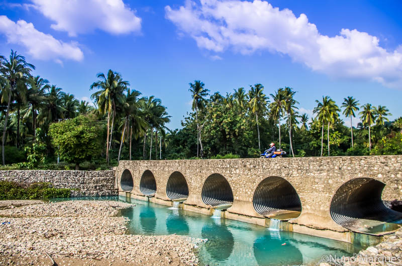

# Explore Vessoru

Welcome to Explore Vessoru, an online platform dedicated to showcasing the hidden gem of Vessoru, nestled within the picturesque region. Our website aims to shed light on this quaint village, brimming with natural beauty and cultural charm, yet largely undiscovered by both local and international tourists.

Through our platform, travelers can discover detailed information about the various attractions, accommodations, and activities available in Vessoru. Whether you're seeking a serene retreat in nature or an enriching cultural experience, our website serves as your comprehensive guide to unlocking the hidden treasures of this captivating village.

Join us on a journey of exploration and discovery as we invite you to uncover the untold wonders of Vessoru, where every corner reveals a new and unforgettable adventure.

## Preview

## How to Use

1. Clone this repository to your local machine.
2. Navigate to the "index.html" file and open it in your web browser.
3. Explore the different sections of the website by clicking on the navigation links [here](https://dashing-kleicha-3e9f2a.netlify.app.)

## Contributing

Contributions are welcome! If you have any ideas, suggestions, or improvements for this website, feel free to open an issue or submit a pull request.

## License

This project is licensed under the [MIT License](LICENSE).
